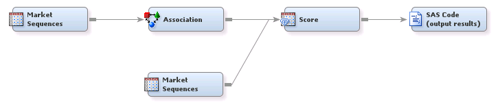

## Association Analysis

##### Example 1: Association Discovery Using SAS&reg; Enterprise Miner&trade;

###### Goal:
The goal is to identify the association between different actions by creating rules. These 
rules will then be used to make recommendations (to predict future actions) for each customer.

###### Files:
AssociationDiscovery.xml, AssociationDiscovery.pdf

***

License: <http://www.apache.org/licenses/LICENSE-2.0>
