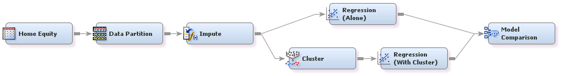

## Clustering

##### Example 1: Using the Cluster and Segment Profile Nodes in SAS&reg; Enterprise Miner&trade;

###### Goal:
The goal is to use the Cluster node and the Segment Profile node to explore the data.

###### Files:
ClusterNodeExplore.xml, ClusterNodeExplore.pdf

***

##### Example 2: Using the Cluster Node in a Predictive Model in SAS&reg; Enterprise Miner&trade;

###### Goal:
The goal is to use the Cluster node to create segments that are used as input to a 
predictive model and to compare this model with a similar model that does not have this input.

###### Files:
ClusterNodePredict.xml, ClusterNodePredict.pdf

*** 

License: <http://www.apache.org/licenses/LICENSE-2.0>
