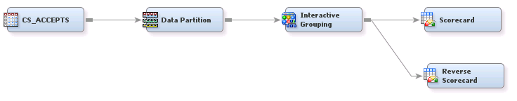
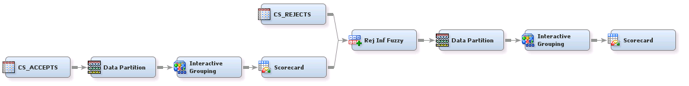

## Credit Scoring

##### Example 1: Scorecard and Reverse Scorecard Using Credit Scoring for SAS&reg; Enterprise Miner&trade;

Scorecards are the standard model for credit scoring because they are easy to interpret and their output can be easily used to 
score new applications. This flow diagram shows the basic steps to build a scorecard and a reverse scorecard. In the output of a 
scorecard, the higher the score, the less likely a client is to default. On a reverse scorecard, the higher the score, 
the more likely a client is to default.

***

##### Example 2: Reject Inference Using Credit Scoring for SAS&reg; Enterprise Miner&trade;

A scorecard that is developed using only the accepted applicants may incur sample bias. The goal of a reject inference 
diagram flow is to solve the bias by calibrating the scorecard in context with a population that includes both accepted and 
rejected observations. This population is usually known as the through-the-door population.

***

License: <http://www.apache.org/licenses/LICENSE-2.0>