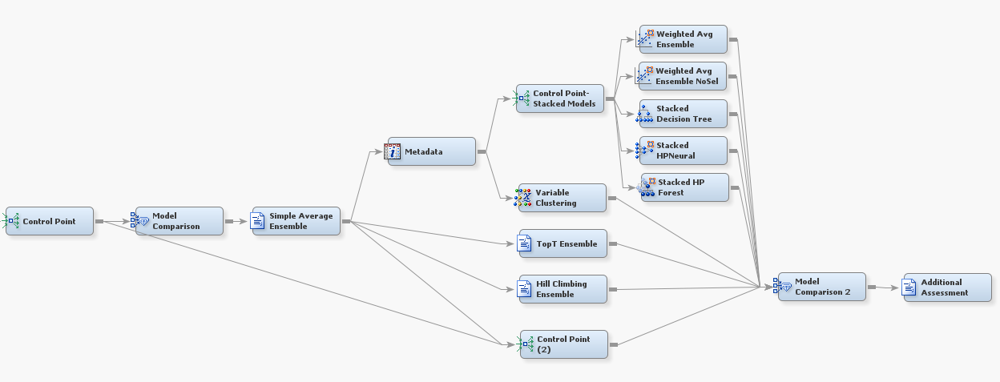

## Ensemble Modeling
Please see the SAS Global Forum 16 paper [Ensemble Modeling: Recent Advances and Applications](http://support.sas.com/resources/papers/proceedings16/SAS3120-2016.pdf) by Wendy Czika, Miguel Maldonado, and Ye Liu for details on the flows provided here that implement ensemble methods that take model performance into account.

***

##### Example 1: Full Flow for Ensemble Modeling Using SAS&reg; Enterprise Miner&trade;

")

 
###### Goal:
The goal is to run an entire flow to perform predictive modeling and apply the ensemble methods from the SAS Global Forum paper.  The full flow consists of the predictive modeling portion of the flow shown here (the "Common Practices" flow from the SAS Global Forum paper) connected to the ensemble subflow shown below in Example 2.

###### File: EnsembleFullFlow.xml

***

##### Example 2: Ensemble Subflow for Ensemble Modeling Using SAS&reg; Enterprise Miner&trade;

###### Goal:
The goal is to apply ensemble methods from the SAS Global Forum paper to an existing predictive modeling flow.  After importing the XML, you can copy this subflow into the diagram with your predictive modeling flow and connect them together by attaching your model nodes to the leftmost Control Point node in this subflow.

###### File: EnsembleSubflow.xml

***

License: <http://www.apache.org/licenses/LICENSE-2.0>
