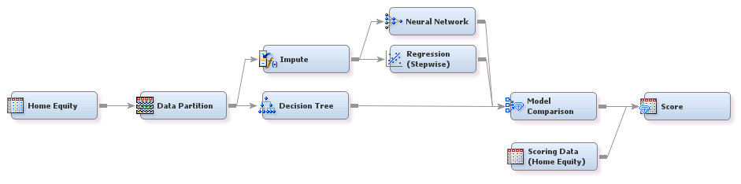
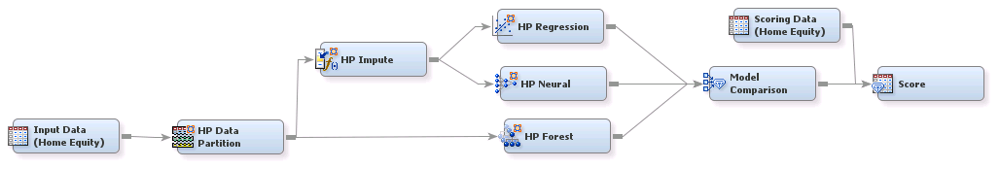
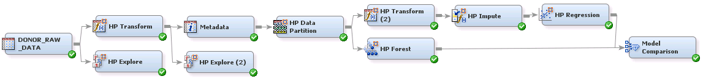

## Predictive Modeling

##### Example 1: Predictive Modeling in SAS&reg; Enterprise Miner&trade;

###### Goal:
The goal is to create a model to predict which home loans will be bad loans (that is, will be defaulted on).

###### Files:
PredictiveModeling.xml, PredictiveModeling.pdf

***

##### Example 2: High-Performance Predictive Modeling Using SAS&reg; Enterprise Miner&trade;

###### Goal:
The goal is to create a model for a binary target that predicts which home loans are likely to be defaulted. This flow 
uses high-performance nodes in SAS Enterprise Miner. If you set up a grid environment, the high-performance nodes run in a 
distributed computing environment, enabling you to use a large number of observations and variables to train and assess a 
predictive in a shorter period of time. These high-performance nodes are built on multithreaded procedures, so you might see 
performance gain even when you run these nodes on single-machine mode.

###### Files:
HPPredictiveModeling.xml, HPPredictiveModeling.pdf

***

##### Example 3: SAS&reg; High-Performance Analytics tip #3: Example flow diagram in SAS&reg; Enterprise Miner&trade;

###### Goal:
Read about this example on SAS communities site at: <https://communities.sas.com/t5/SAS-Communities-Library/SAS-High-Performance-Analytics-tip-3-Example-flow-diagram-in-SAS/ta-p/248960>

###### Files:
HPPredictiveModelingTip.xml, HPPredictiveModelingTip.pdf

***

License: <http://www.apache.org/licenses/LICENSE-2.0>