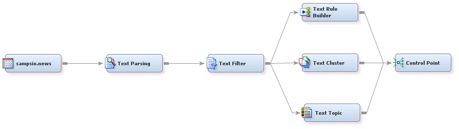
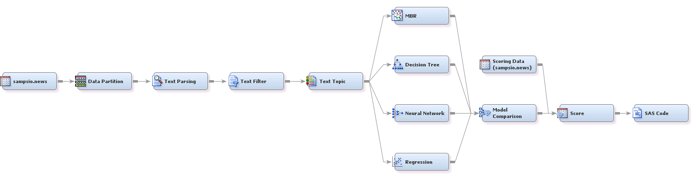

## Text Mining

##### Example 1: Text Mining Exploration in SAS&reg; Enterprise Miner&trade;

###### Goal:
The goal is to use SAS Enterprise Miner text mining nodes to explore text data.

###### Files:
TextMiningExplore.xml, TextMiningExplore.pdf

***

##### Example 2: Text Mining Classification in SAS&reg; Enterprise Miner&trade;

###### Goal:
The goal is to classify textual articles by the article’s content.

###### Files:
TextMiningClassify.xml, TextMiningClassify.pdf

***

License: <http://www.apache.org/licenses/LICENSE-2.0>