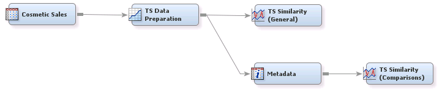

## Time Series

##### Example 1: Time Series Exploration and Comparison Using SAS&reg; Enterprise Miner&trade;

The goal is to explore a time series data set and organize it into a format for further analysis that compares 
different time series in the data.

***

License: <http://www.apache.org/licenses/LICENSE-2.0>